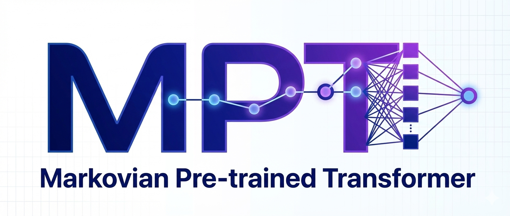
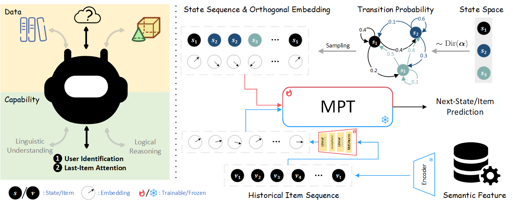

<div align="center">
  
</div>

<h5 align="center">
    <p>
        <a href="">Paper</a> |
        <a href="">Slide</a>
    </p>
</h4>


## ⚙️ Requirements

<h5 align="center">
    <p>
        Python == 3.10.18</a> |
        <a href="https://pytorch.org/">PyTorch == 2.5.1</a> |
        <a href="https://github.com/huggingface/transformers.git">Transformer == 4.56.2</a> |
        <a href="">FreeRec == 0.9.5</a>
    </p>
</h4>

## 🌟 Usage


```
┌── data # the 'root' path of data
│	├── Processed
│	│	├── Amazon2014Beauty_550_LOU # the training data
│	│	└── ...
│	├── Amazon2014Beauty.zip # the raw data
│	└── ...
|
├── logs # training logs
|
├── models # saving pre-trained models: e.g., sentence-t5-xl
|
├── configs
│	├── finetune.yaml # config for fine-tuning
│	└── pretrain.yaml # config for pre-training
|
├── encode.py # encoding item features
|
├── finetune.py
├── pretrain.py
|
└── sampler.py # sampling Markov trajectories
```


<div align="center">
  
</div>

### Markovian Pre-Training

    python pretrain.py --config configs/pretrain.yaml --alpha 0.05 --num-states 30


> [!TIP]
> The pre-trained models are stored in the `logs/...` directory.

### Recommendation Fine-Tuning


    python finetune.py --config configs/finetune.yaml --dataset Amazon2014Beauty_550_LOU --path logs/...


> [!NOTE]
> To reproduce the results presented in the paper, one should follow the steps outlined in [data/README.md](data/README.md) and [models/README.md](models/README.md) to download the processed datasets and pre-trained models.

## Acknowledgements

1. [Simon-Lepage/MarkovICL](https://github.com/Simon-Lepage/MarkovICL): We sincerely thank Simon Lepage for sharing the code.

## Citation

```
@article{xu2025mpt,
  title={Markovian Pre-Trained Transformer for Next-Item Recommendation},
  author={Xu, Cong and Li, Guoliang and Wang, Jun and Zhang, Wei},
  journal={},
  year={2026}
}
```